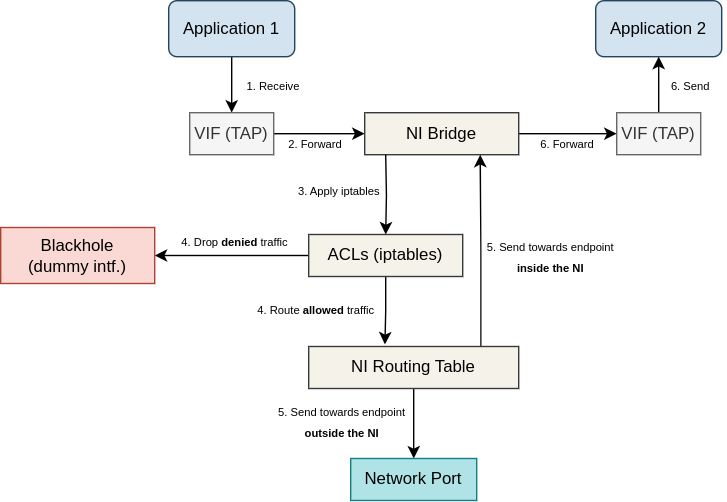
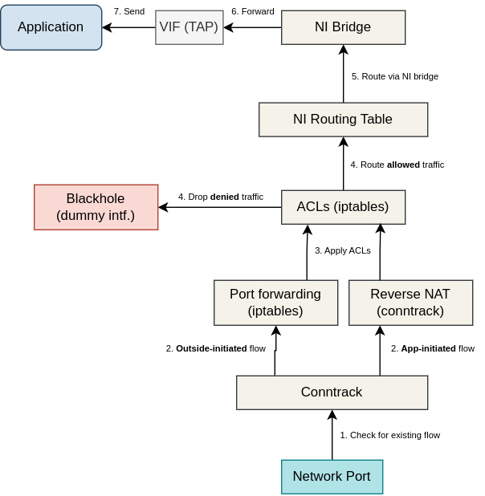
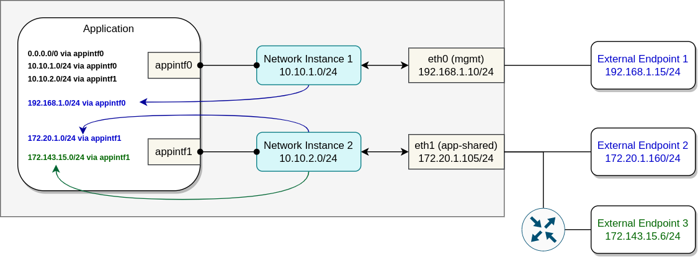
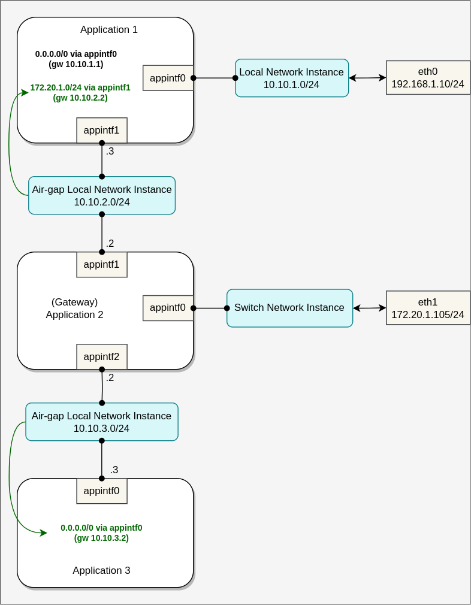

# Application Connectivity

Edge applications often require network connectivity to access other applications or some
external network endpoints. EVE provides different means of connectivity, varying in properties,
feature-sets and performance considerations.

## Application network interfaces

Network connectivity is enabled for an application by configuring one or more network adapters.
These consists of [virtual network interfaces](#virtual-network-interfaces), connecting
application with [network instances](#network-instances), and directly assigned
[physical NIC](#physical-network-ports) or [SR-IOV virtual functions](#sr-iov-vfs).
The order of network adapter configurations inside `AppInstanceConfig` matters, because this
is the same order at which these network adapters will be presented to the application by the
Virtual Machine Manager (VMM).
This order is reflected in the PCI addresses of the adapters. It is important to note that VIFs
and direct assignments are configured in two separate lists. The VMM is configured to present
VIFs first, adhering to their configured order, followed by direct assignments in their respective
order. User cannot enforce direct assignment to appear before VIF.

### Physical network ports

EVE allows applications to directly access physical NICs and avoid any virtualization overhead.
This is especially useful for applications that require high-performance network connectivity.
Another use-case is when EVE does not provide suitable driver for the NIC (or the driver is
proprietary and for licensing reasons cannot be shipped with EVE). In such case, the application
can have the driver installed and use the NIC directly.

The following hypervisor capabilities are used to manage IOMMU-based device assignments
to application domains:

* [Xen PCI Passthrough](https://wiki.xenproject.org/wiki/Xen_PCI_Passthrough) for Xen
* [QEMU/VFIO Passthrough](https://wiki.archlinux.org/index.php/PCI_passthrough_via_OVMF) for KVM

### SR-IOV VFs

SR-IOV NIC VFs (virtual functions) combine the resource-sharing advantages of virtual interfaces
with performance benefits of direct assignments.
In this case, the virtualization of the physical resource (NIC) is done by the hardware itself.
EVE OS manages the PF (physical function) inside the host, creates virtual functions based
on the configuration (device model), and performs direct assignment of these VFs into applications
(using the very same technologies as for physical ports).

The main difference between directly assigned VF and a physical port from the application
perspective, is that virtual function requires a different "VF" driver variant to operate
the network adapter.

Please beware that so far only Intel I350 NIC with `igb`/`igbvf` drivers was tested and verified
to work with EVE.

### Virtual network interfaces

Virtual network interface (abbreviated to VIF) is a pair of network devices. The first of these
(the frontend by the [xen terminology](https://wiki.xenproject.org/wiki/Xen_Networking))
will reside in the guest (application) domain while the second (the backend in Xen, TAP with
kvm/qemu) will reside in the host (Dom0 for xen).
This virtual link is created in a cooperation between EVE and the hypervisor to connect
application with a [network instance](#network-instances).

By default, VIF is a paravirtualized VirtIO device. A VM application therefore has to have
a VirtIO driver installed to be able to connect to network instances. Container applications
are running inside a VM prepared by the EVE, with the driver already included.
Without HW-assisted virtualization capabilities, EVE will fallback to an emulated e1000 NICs,
with higher CPU overhead and worse performance. The upside is that the e1000 driver emulates
a widely used Intel 82540EM network interface card, making it compatible with a broad range
of operating systems that include built-in support for this hardware.

On the host (EVE) side, VIF has interface name `nbu<vif-num>x<app-num>` and is enslaved
under the bridge of the corresponding network instance. On the guest side, the VIF
interface name will be `eth<index>` for a container app, or it will completely depend
on the OS of a VM application and its interface naming rules.

IP addresses are given to application VIFs using DHCP with a limited lease time. This means
that a DHCP client should be running inside the guest VM, requesting IP addresses on boot
and anytime a lease times out. For container apps this is taken care of by the init script
of the wrapper VM prepared by EVE. When app container starts, virtual interfaces are already
initialized and have IP addresses assigned.
VM applications are required to perform DHCP requests themselves. Cloud-init is commonly used
to instruct the app OS to perform DHCP on selected network interfaces.

Data-plane of VIFs spans across both guest and host network stacks. Packet sent from an application
is routed by the guest OS (Alpine Linux for container apps) and transmitted across a VIF
into the host network stack. It arrives via TAP/xen-backend and gets forwarded to the NI bridge.
Next, ACLs implemented using iptables are applied and the packet is either marked with "allow"
or "drop" mark. Based on the mark and the src/dst addresses, IP rules either send the packet
into the dummy blackhole interface (dropped), or route the packet according to the NI routing
table. If the destination is external, packet will be transmitted out through the uplink port.
Note that if NI is switch (L2 only), packet will be just forwarded through the uplink, not routed.
If the destination is another app (inside the same NI), packet's dst MAC address will be set
to the dst app MAC, and it will be forwarded again through the same bridge into the corresponding
VIF. Finally, the packet is transmitted from the host network stack into the guest network
stack of the destination application, where it will be processed for local delivery.
The diagram below depicts all these packet-flow stages:

Packet received from outside and destined to an application is received via network port
and matched against active flows tracked by the [Linux connection tracking subsystem](https://conntrack-tools.netfilter.org/manual.html).
In case of an app-initiated flow and a local NI (L3, with NAT), inbound packets will match
an existing contract entry and the NATed dst IP address and port number will be reversed back
to the application src address. In case of an outside-initiated flow, apps connected over local NIs
can only be accessed over port forwarding rules. If a rule is matched, dst IP and port are
D-NATed to the application address.
Next, ACLs are applied. Packet is either marked with "allow" or "drop" mark. Based on the mark
and the dst address, IP rules either send the packet into the dummy blackhole interface (dropped),
or route the packet according to the NI routing table. This will then match the link-local route
of the NI bridge and gets forwarded via the bridge and the VIF into the application.
Note that in case of a switch NI (L2 only), D-NAT and routing operations are not performed
and inbound packets are simply forwarded from the uplink, through the bridge and VIF into
the application (still the ACLs do apply and can trigger routing into the blackhole interface).
The diagram below depicts all these inbound packet-flow stages:

## Network instances

Network instance (NI for short) is a virtual switch deployed inside an edge-device,
allowing applications (virtual machines or containers) to communicate with one another over
a virtual network. Network instance represents a single network segment. Depending on the type
and configuration, it is either internal to the edge-node or an extension of an external network
segment.

Network instances are a feature of the EVE OS host networking build using various software tools.
Applications connect to network instances using [virtual network interfaces](#virtual-network-interfaces).
Directly assigned physical network ports or SR-IOV VFs bypass the host networking, thus cannot
be part of network instances. Apart from VIFs, network instance can be connected to a physical
or logical (e.g. VLAN) [uplink network port](#uplink-port) (inside the host) and provide
applications external connectivity.

It is possible to deploy any number of network instances onto the same device. Applications
connected to the same network instance will be able to talk to each other without having to use
any physical network equipment. Reachability between applications in different network instances
will be possible only if there is a routed/forwarded path between these network instances across
physical uplinks and their networks. Application is allowed to be connected to multiple network
instances and even to have multiple VIFs inside the same NI. In such cases, it is important to have
the routing inside the app configured correctly to ensure that a given flow uses the right interface
(see [Network Instance IP routing](#application-ip-routing)).

However, even if the network topology provides a path from one application to another or to an external
endpoint, a given flow must still be explicitly allowed by user-configured L3/L4 [ACLs](NETWORK-ACLS.md).
ACLs are configured per application VIF, separately for inbound and outbound directions.
By default, application is not allowed to send or receive any traffic with the exception
for the DHCP and DNS traffic (i.e. the implicit default rule is to drop everything).

Network instances do not have to be used at all. Applications can simply only use direct assignment
of physical NICs or SR-IOV VFs. The downside of direct assignments is less flexibility and less
efficient physical resource utilization. Network instances allow to share physical network ports
or even to avoid using them when not necessary. The downside of NI is an extra overhead introduced
to the data-plane from the virtualization. Performance-sensitive applications should prefer
direct assignments and use NIs only for e.g. management traffic.

Presently, EVE provides only 2 simple kinds of network instances: *Local* and *Switch*.
The idea is that anything more advanced (VPN, network mesh, etc.) should be provided
by an application.

### Local Network Instance

Local network instance uses a (user-selected) private IP subnet. Traffic flowing between
applications and external endpoints is being routed (one hop inside the host) and NATed.
This means that packets with IP addressed from the NI private IP subnet never appears outside
the edge device. Same is true for application MAC addresses due to the routing hop.
For this reason it is more common to let EVE generate MAC address for an application
than to configure one statically.

The use of NAT prevent applications from being directly accessible from outside. User must
configure port forwarding rules (for TCP or UDP) to allow an external endpoint to initiate
communication with an application. These rules are configured as part of [network ACLs](NETWORK-ACLS.md).

Meanwhile, applications connected to the same Local NI can communicate with each other directly,
they are on the same network segment after all. However, by default EVE grants applications DHCP
leases with /32 IP addresses (even if network prefix of the NI is something else). This is then
accompanied by a link-local route for the whole subnet, with gateway pointing to the IP address
assigned to the NI bridge created inside the host. This seemingly strange configuration makes
traffic going from one app to another routed through the host (even though it could be just forwarded).
We do this because it better enforces the use of ACLs and makes flow logging easier.
The all-ones subnet netmask can be problematic to some applications, however. In such case,
it is possible to disable it (and use proper subnet mask) with `debug.disable.dhcp.all-ones.netmask`.

For Local network instances, EVE runs basic network services like DHCP or DNS internally.
Every application VIF is either automatically allocated IP address or a user-configured IP
address is used. In both cases, DHCP server deployed for the NI is configured with a host entry
mapping the VIF MAC address (generated or user-defined) to this IP address. EVE will monitor
DHCP traffic and detect when the application finally asks for this IP address using its DHCP
client. Only then the VIF IP address is published to the controller as part of the Info message.

DHCP server also inform application about the DNS server(s) to use. By default, this will only
include the DNS server run be EVE for the NI, listening on the NI bridge IP. In fact, DHCP and
DNS servers are deployed by EVE as the same [dnsmasq](https://thekelleys.org.uk/dnsmasq/doc.html)
process. User is able to avoid EVE's DNS server from being used and provide its own list of DNS
servers for applications.

Additionally, DHCP server can be used to [propagate IP routes](#application-ip-routing)
as well as IP addresses of NTP servers to applications. User is able to configure one NTP server
IP per local network instance. This is then merged with NTP server(s) set for the NI uplink
(received from external DHCP server or configured by the user), and propagated together
to the application using the DHCP option 42 (56 in DHCPv6).

DNS server which EVE provides for every Local NI allows resolution of application names
to their IP addresses. This is very handy when applications need to talk to each other but
cannot predict how EVE will allocate IP addresses between them.
Every other name resolution request is just forwarded to DNS servers associated with
the uplink (received from external DHCP server or configured by the user).

Applications connected to local NI are also provided with access to Metadata HTTP server,
running on local-only IP address 169.254.169.254. This can be used by applications
to retrieve cloud-init configuration, obtain information from EVE (e.g. device UUID,
hostname, uplink IP address) or to download [patch envelopes](PATCH-ENVELOPES.md).
More information about metadata server can be found in [ECO-METADATA.md](ECO-METADATA.md).

#### IPAM

Every Local Network Instance must be configured with an IPv4 network subnet and an IP
range within this subnet for automatic IP allocations. Host IP addresses from this subnet
that do not fall within the IP range are available for manual assignment.

Whether an IP address is selected manually or dynamically assigned by EVE from the configured
IP range, an internal DHCP server is used to distribute these IP addresses to applications.
Container applications are deployed inside a "shim VM", which EVE prepares, ensuring that
a DHCP client is running for every virtual interface connected to a network instance
This guarantees that the IP address is received and applied before the application starts.
In contrast, VM applications are responsible for starting their own DHCP client and applying
the received IP addresses.

Regardless of the application type, EVE does not automatically assume that the allocated
IP address is actually in use. Instead, it monitors the set of IP leases granted by the internal
DHCP server and updates the set of application IP addresses in the published info messages
accordingly.

### Switch Network Instance

Switch Network Instance is a simple L2-only bridge between connected applications and
(optionally) an uplink network adapter. Traffic is only forwarded by the host network stack.
This allows applications to directly access external endpoints and vice-versa.
Switch network can be configured without uplink (i.e. as air-gapped), in which case it is merely
a bridge between application VIFs.

EVE does not run DHCP server for Switch NI. Instead, external DHCP server from the uplink's
network can be configured by the user to provide IP addresses to applications. In case of air-gap
switch NI, one of the applications can run DHCP server for the network.

Application MAC addresses can be either statically user-configured, or generated by EVE.
Since multiple edge devices running EVE can connect to the same network segment via switch NIs,
the MAC address generator will apply a hash function to the app UUID in an attempt to produce
MAC address unique across the entire fleet of devices (and not just within one device).

Despite Switch NI operating only at the L2 layer, the L3/L4 [network ACLs](NETWORK-ACLS.md)
are still supported and must be configured to allow anything beyond just DNS and DHCP to pass.
Since there is no NAT between applications and external endpoints, properly configured
inbound ACL rules are that much more important.

Metadata HTTP server is run for switch network instance only if it has uplink port with
an IP address.

#### IP address detection

Unlike a Local Network Instance, a switch network instance is configured without any IP
configuration, and EVE does not run an internal DHCP server. Instead, if IP connectivity
is required, IP addresses must be assigned statically within the connected applications
or provided by an external DHCP server or another application offering DHCP services.

Since EVE is not in control of IP address allocations and leases, it must monitor application
traffic to learn which IP addresses are being used and report this information to the controller.

In the case of an external DHCP server (IPv4), EVE captures the DHCPACK packet from the server,
which confirms the leased IP address. Because EVE manages MAC address allocations, it knows
the MAC address of every application's virtual interface (VIF). It can then map the CHADDR
(Client Hardware Address) attribute to the corresponding application VIF and learn the assigned
IP address from the YIADDR (your, i.e. client, IP Address) attribute. Additionally, EVE reads
the DHCP option 51 (Lease Time), if available, to determine how long the leased IP address
is valid. If EVE does not observe an IP renewal within this period, it assumes that the IP address
is no longer in use and reports this change to the controller.

For statically assigned IPv4 addresses, EVE captures both ARP reply and request packets to learn
the application VIF IP assignment from either Sender IP + MAC or Target IP + MAC attribute
pairs. Since ARP cache entries have a limited lifetime — typically around 2 minutes — EVE expects
to see at least one ARP packet for every assigned IP within a 10-minute window (this is not
configurable). If no ARP packet is observed within this period for a previously detected IP
assignment, EVE assumes that the IP address has been removed and reports this change to
the controller. EVE also captures ARP packets for IP addresses configured via DHCP, but these
are ignored as the information from the previously captured DHCPACK takes precedence.
Note that ARP-based IP detection is enabled by default but can be disabled by setting
the configuration item `network.switch.enable.arpsnoop` to `false`. Change in this config
options will apply to already deployed switch network instances.

For an external DHCPv6 server, EVE captures DHCPv6 REPLY messages. It learns the target MAC
address from the DUID option (Client Identifier, option code 1), while the IPv6 address
and its valid lifetime are provided by the IA Address (option code 5).

To learn IPv6 addresses assigned using SLAAC (Stateless Address Auto Configuration),
EVE captures unicast ICMPv6 Neighbor Solicitation messages. These are sent from the interface
with the assigned IPv6 address to check if the address is free or already in use by another
host — a process known as Duplicate Address Detection (DAD). The ICMPv6 packet sent to detect
IP duplicates for a particular VIF IP will have the VIF MAC address as the source address
in the Ethernet header. EVE uses this, along with the "Target Address" field from the ICMPv6
header, to identify the assigned IPv6 address.

EVE is capable of detecting multiple IPs assigned to the same VIF MAC address. This is commonly
seen when applications use VLAN sub-interfaces, which share the parent interface's MAC address.

### Uplink Port

Network instances can be configured with an "uplink" network adapter, which will be used to provide
external connectivity. The network adapter can be a physical network port (e.g. `eth0`) or a logical
network adapter on top of physical port(s) (e.g. a VLAN sub-interface or a LAG). Moreover,
instead of selecting a specific adapter referenced by its unique logical label, it is possible
to use one of the special group labels to let EVE pick the best network adapter with a working
connectivity. Group labels currently supported are:

* "uplink": use any *management* network adapter
* "freeuplink": use any *management* network adapter with *zero cost*

If group label is configured, EVE will perform periodic testing of all matched network adapters
for working connectivity. Every 15 seconds, the adapter's next hop reachability is tested using
ICMP ping. However, for non-zero cost adapters this test is disabled to avoid generating too much
(costly) traffic. Additionally, every 2.5 minutes, EVE will try to connect to the controller
over the interface (provided that the adapter is enabled for EVE management). Both of these tests
must consecutively fail few times in a row for the adapter to be deemed disconnected. EVE will then
switch all network instances with group uplink label that use the "broken" port to another
matching adapter with working connectivity. The requirement for multiple consecutive test
passes/failures prevents from uplink flapping, i.e. switching between adapters too often.

Network instance (both Local and Switch) can be configured without any uplink. In this case,
the network is "air-gapped", meaning that it is not reachable from outside and, likewise,
it will not provide external connectivity to the applications. Air-gap NIs are used only to connect
applications running on the same edge device.

### Flow Logging

EVE uses [Linux connection tracking](https://conntrack-tools.netfilter.org/manual.html)
to periodically (every 2 minutes) record all application TCP and UDP flows. A flow record
encapsulates application UUID, VIF name, open/close timestamps, src/dst IP/port/proto 5-tuple,
packet and byte counters.

Additionally, EVE captures DNS packets to make a recording of every DNS request from application.
This includes the request time, hostname that was being resolved and the returned IP address(es).

A batch of new flow records is published to the controller (POST `/api/v1/edgeDevice/flowlog`)
inside `FlowMessage`.

### Application IP routing

Most of the edge deployments will deploy applications that will have connectivity to both
WAN (Internet) and LAN (e.g. shop floor, machine floor).
There may be a single WAN interface and multiple LAN interfaces. With the IP route
configurability of (Local) Network instances provided by EVE, we can automatically (zero-touch)
provision routing for applications that have access to both the Internet and one or more LANs.
This is possible because EVE allows to:

* use DHCP (option 121) to propagate the *connected routes* to applications (routes for external
  networks that NI uplinks are connected to)
* configure a set of *static IP routes* for a network instance and have them propagated
  to applications also by DHCP

Picture below portrays an example of an application with two interfaces, connected via
separate network instances to two different network ports. Blue color is used to highlight
the connected routes, which, when enabled, EVE will automatically propagate into the application.

For external networks one or more routing hops away (i.e. not directly connected to the device),
user is able to configure static IP routes and let EVE propagate them to the application
also using DHCP. Static routes are part of the network instance configuration. User configures
destination IP subnets which the network instance will become the gateway for (from the app
perspective). In the example below, the propagated static route is highlighted with the green
color.

Another common case is using one application as a network gateway for other applications
running on the same device. The gateway application may provide some network function(s),
such as firewall, IDS, network monitoring, etc. Such application will connect on one side with
the external network(s) using directly attached network adapter(s) or via switch network
instance(s), and the other side will make use of an air-gap local network instance to connect
with other applications running on the device. Propagated static IP routes are necessary
to make the application traffic flow through the gateway app. In theory, multiple network
functions can be chained together in this way using several air-gap network instances
with static IP routes.

In the example below, "Application 1" uses "Application 2" as a gateway for only one subnet,
while "Application 3" uses the application gateway for all the traffic. Green color highlights
static IP routes propagated to applications.

#### Default Route

Network instance default route (with the NI bridge IP as the gateway) is automatically
propagated by DHCP to connected applications, unless network instance is air-gapped
(without uplink) or the uplink is app-shared (not management) and does not have a default
route of its own. In both cases, it is possible to enforce default route propagation
by configuring a static default route for the network instance.
